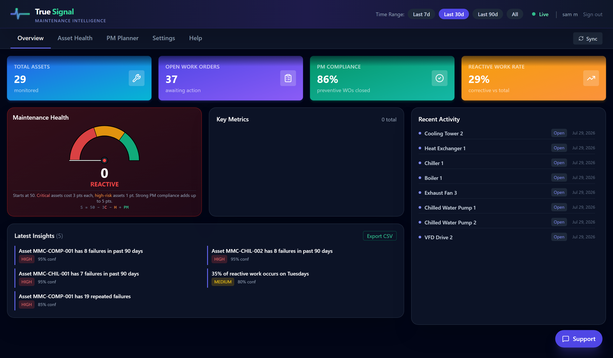
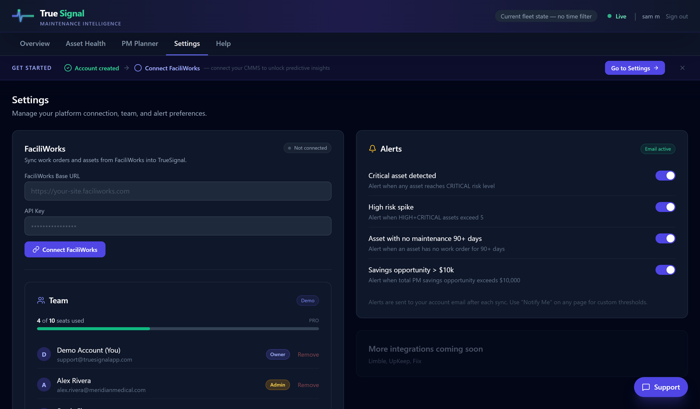
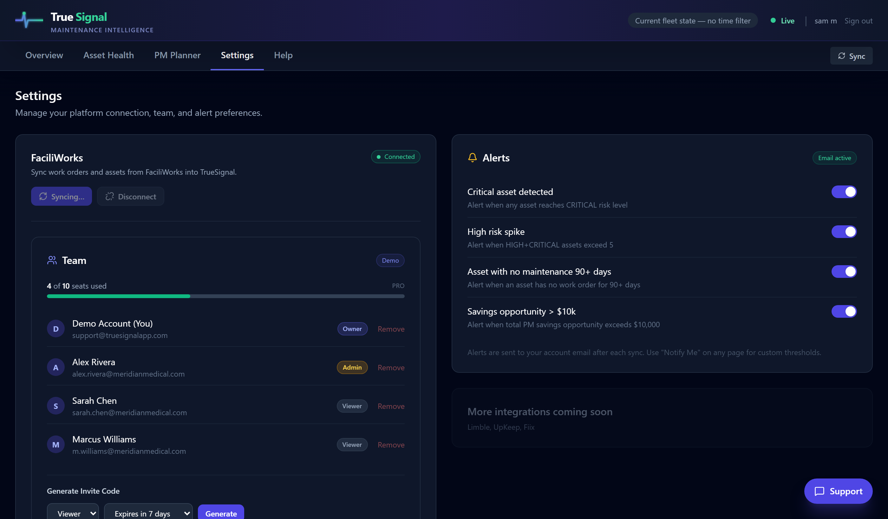
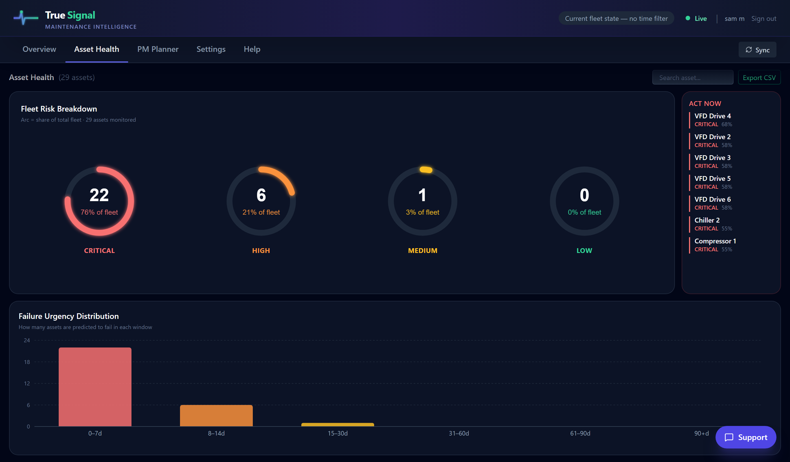
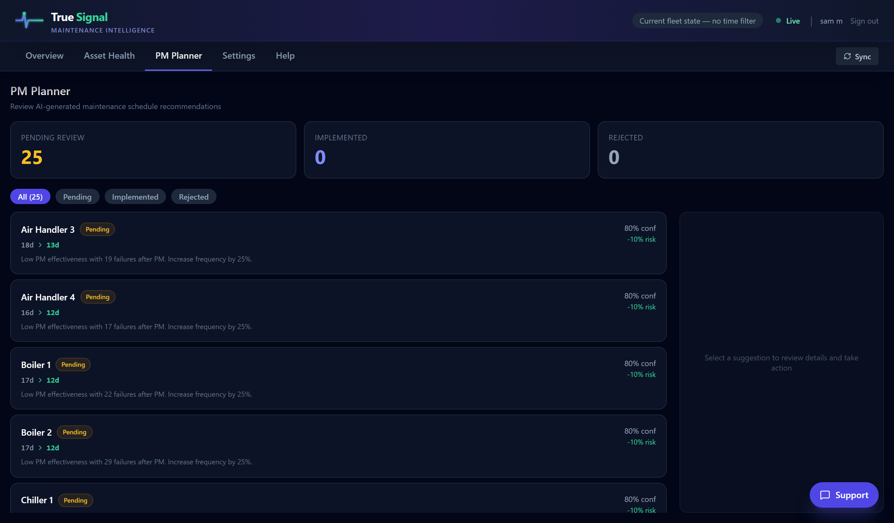

# TrueSignal — Predictive Maintenance Intelligence

Maintenance teams lose hours every week chasing false alarms and reacting to unexpected failures. TrueSignal connects to FaciliWorks, analyzes work order history, and tells you which assets are going to fail — before they do.

**[→ Try the live demo](https://truesignalapp.com)** — no sign-up required

---



---

## The Problem

Most CMMS tools are good at recording what happened. None of them tell you what's about to happen. Maintenance managers run on gut feel and reactive schedules, missing early failure signals buried in thousands of work orders.

## What TrueSignal Does

- **Failure predictions** — Every asset scored CRITICAL / HIGH / MEDIUM / LOW with estimated days to failure
- **PM optimization** — Identifies over- and under-maintained assets, generates adjusted PM schedules
- **KPI intelligence** — Strips out rushed completions and data quality distortions to show real metrics
- **AI insights** — Plain-language summaries of what's happening across your fleet

---

## How It Works — From Onboarding to Insights

### 1. Connect FaciliWorks

After signing in, you're prompted to connect your FaciliWorks instance. Enter your site's base URL and API key — TrueSignal stores the key encrypted at rest and immediately runs an initial sync.



### 2. Sync Runs

The sync pulls assets, corrective maintenance work orders, and PM records from FaciliWorks via their REST API. The prediction pipeline processes each asset's work order history — failure frequency, PM compliance, time between failures — and scores every asset.



### 3. Overview Dashboard

The main dashboard shows your fleet's health score, risk distribution, and the assets that need attention today. Filterable by 7 / 30 / 90 days or all time.


### 4. Asset Health

Every monitored asset ranked by failure risk. CRITICAL and HIGH assets surface at the top with clear urgency signals. Drill into any asset to see its prediction detail and work order history.



### 5. PM Planner

AI-generated PM schedule recommendations you can accept, defer, or push directly back to FaciliWorks as a new work order — closing the loop without leaving TrueSignal.



---

## Simulating FaciliWorks for Demo & Testing

FaciliWorks exposes a REST API used by their web client — paginated JSON endpoints with `X-API-KEY` header authentication and a `loadOptions` query parameter that controls pagination (skip/take), filtering, and sorting.

Rather than requiring a live FaciliWorks license to run the app, we built a mock server (`backend/mock_faciliworks.py`) that replicates the exact FaciliWorks API contract by reading their documentation:

- `GET /v1/assets` — returns 29 assets in FaciliWorks equipment format
- `GET /v1/cm` — returns corrective maintenance work orders
- `GET /v1/pm` — returns preventive maintenance work orders
- `POST /v1/cm` — creates a new work order (used by the PM push feature)

The mock generates realistic hospital CMMS data deterministically (`random.seed(42)`) — the same 29 assets and ~250 work orders every time, so test results are reproducible. It's mounted on the production backend at `/mock-fw`, which means anyone can connect to it to test the full pipeline end-to-end without a FaciliWorks account.

**To test it yourself:** sign up for a free account, go to Settings, and enter:

| Field | Value |
|---|---|
| Base URL | `https://maintenance-analytics-mvp.onrender.com/mock-fw` |
| API Key | `demo-key` |

This runs a real sync and prediction pipeline against mock data — you'll see the full onboarding flow, not a pre-loaded state.

---

## Stack

| Layer | Tech | Why |
|---|---|---|
| Frontend | React + Vite + Tailwind + Recharts | Fast iteration, no runtime overhead |
| Backend | FastAPI (Python) | Async-friendly, great for data-heavy endpoints |
| Database | Neon PostgreSQL | Serverless Postgres with connection pooling |
| Auth | JWT (python-jose) | Stateless, works across free-tier deployments that spin down |
| Deployment | Vercel (frontend) + Render (backend) | Both free tiers survive portfolio project traffic |

---

## Architecture

```
Browser (Vercel)
    ↓ HTTPS
FastAPI (Render)
    ├── /auth         JWT auth, demo login
    ├── /predictions  Failure predictions + PM suggestions
    ├── /kpis         Daily/weekly/monthly KPI aggregates
    ├── /settings     FaciliWorks credential storage (AES-256 encrypted)
    ├── /reports      PDF/CSV export
    └── /mock-fw      Mock FaciliWorks API (replicates real API contract)
    ↓
Neon PostgreSQL
    ├── orgs / locations / users  (multi-tenant, all data scoped to location_id)
    ├── asset_failure_predictions
    ├── pm_optimization_suggestions
    └── work_orders / kpi_daily / kpi_weekly
```

---

## Key Technical Decisions

**Why encrypt API keys at rest?** FaciliWorks credentials give read access to a customer's entire CMMS. Storing them in plaintext in a shared database would be a single point of compromise. Keys are AES-256 encrypted before write, decrypted only inside the sync worker — never returned to the frontend.

**Why a separate prediction pipeline instead of in-request computation?** Failure scoring runs across months of work order history per asset. Running that synchronously on every page load would make the app unusable. Instead, predictions are precomputed on sync and served as simple table reads.

**Why a mock FaciliWorks server instead of fixtures?** Fixtures only test one layer. The mock server lets the full chain — HTTP adapter → data normalization → pipeline → predictions → API → frontend — run against a realistic data source in a single `uvicorn` process. It also means anyone can demo the real connection flow without a FaciliWorks license.

---

## Local Setup

```bash
# 1. Clone and configure
cp .env.example .env
# Fill in: DATABASE_URL (Postgres), SECRET_KEY (any random string)

# 2. Backend
pip install -r requirements.txt
uvicorn backend.api:app --reload
# → http://localhost:8000

# 3. Frontend
cd frontend && npm install && npm run dev
# → http://localhost:5173

# 4. Mock FaciliWorks (optional — or use the hosted one above)
uvicorn backend.mock_faciliworks:app --port 8001 --reload
# Settings → Base URL: http://localhost:8001, API Key: any-string
```

---

## What I'd Do Next

- **Rate limiting** — slowapi middleware to protect the Render free tier from traffic spikes
- **Webhook sync** — replace the manual sync button with FaciliWorks webhooks for real-time predictions
- **More CMMS adapters** — MaintainX and Limble share similar schemas; the adapter pattern is already in place
- **Anomaly detection** — replace heuristic failure scoring with a lightweight model trained on historical breakdown patterns
